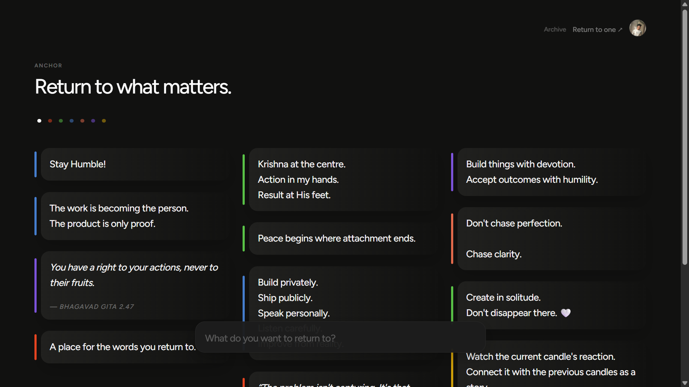
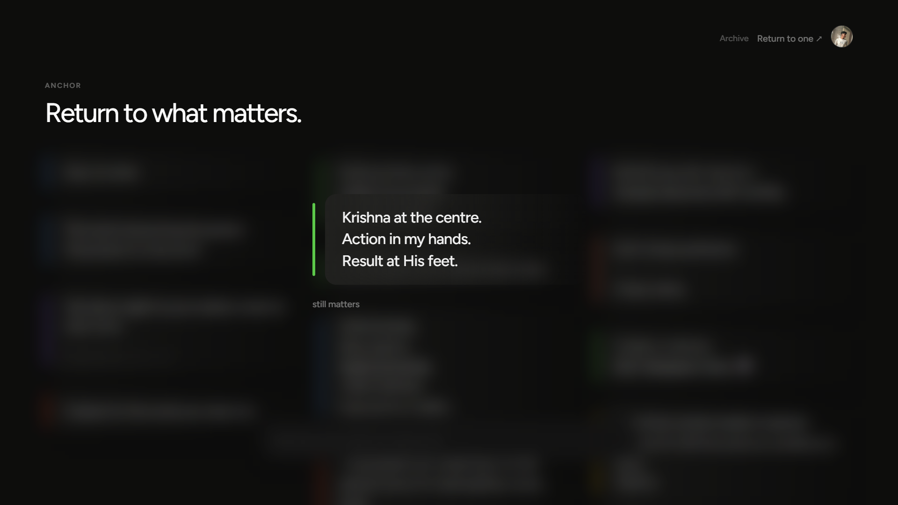
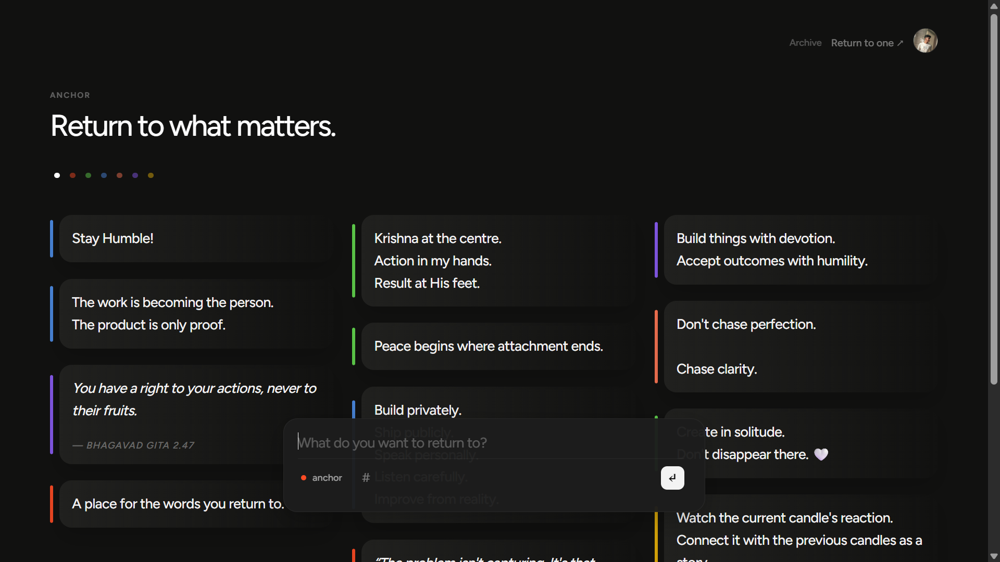

# Anchor

> Return to what matters.


Modern technology helps us create more than ever before.

More notes.
More conversations.
More ideas.
More information.

Yet the things that shape our lives most are often the easiest to lose.

A promise we made to ourselves.

A lesson we learned the hard way.

A thought worth returning to.

A value we never want to forget.

Anchor was created to give those moments a home.

Rather than helping us create more, Anchor helps us preserve what already matters.

It is a quiet place for the thoughts you never want to lose. A calm space to capture meaningful reflections, organize them with intention, and return to them whenever life becomes noisy.

Built with **Next.js**, **Supabase**, **GPT-5.6**, and **Codex**.

Designed around one simple belief:

> **Technology should help us return—not distract us.**

---

## Preview

### Homepage

<p align="center">
  
</p>
> A quiet place for the thoughts you never want to lose.

### Anchor Wall

<p align="center">
  
</p>

### Writing

<p align="center">
  
</p>

### Reading

<p align="center">
  
</p>

## Demo

🎥 Watch the demo

https://youtu.be/k8eqqdRCol0

---

# Why Anchor Exists

The world doesn't suffer from a lack of information.

It suffers from a lack of attention.

Every day we're encouraged to consume more.

More content.

More notifications.

More conversations.

More AI.

Yet the thoughts that shape our lives are usually the quiet ones.

A realization during a difficult day.

A promise made to ourselves.

A lesson we never want to repeat.

A piece of wisdom from someone we love.

Anchor exists to protect those moments.

Not by replacing our thinking.

But by helping us preserve it.

---

# Product Philosophy

Everything inside Anchor is guided by three principles.

### Return over accumulation

Anchor isn't designed to collect everything.

It exists to help people return to what truly matters.

### Clarity over complexity

Every screen should feel calm.

Every interaction should feel obvious.

Every feature should earn its place.

### Reflection over consumption

Technology shouldn't only help us move faster.

It should also help us think better.

---

# What Anchor Does

Anchor is a personal sanctuary for meaningful thoughts.

Current capabilities include:

- Capture meaningful thoughts
- Organize anchors with categories
- Secure Google authentication
- Responsive minimalist interface
- Beautiful writing experience
- Browse and revisit saved anchors

Rather than becoming another productivity system, Anchor focuses on preserving moments worth returning to.

---

## Current MVP

Anchor is intentionally focused on a small, polished core experience.

The current release includes:

- Google Authentication
- Creating and saving Anchors
- Category organization
- Browsing previous reflections
- Responsive web experience

Some ideas described in the roadmap are intentionally not part of the current MVP.

---

Building with OpenAI

Anchor was built through continuous collaboration with OpenAI tools during Build Week.

Rather than treating AI as something that simply generated code, I used it as a collaborative partner throughout product design, engineering, documentation, and iteration.

How I collaborated with Codex

Codex became my engineering partner throughout development.

I used it to:

Bootstrap parts of the Next.js application
Configure Supabase authentication and project structure
Implement React components
Explore different UI implementations
Debug implementation issues
Refactor existing code
Improve TypeScript quality
Verify production builds
Accelerate repetitive engineering tasks

Development was highly iterative.

Many implementations were refined, replaced, or even rolled back after evaluation because they didn't align with the experience I wanted Anchor to provide.

Instead of accepting every generated solution, I treated Codex as an experienced engineering collaborator whose work I continuously reviewed, modified, and integrated into the project.

How I collaborated with ChatGPT

While Codex accelerated engineering, ChatGPT became a product and design collaborator.

It helped me think through:

Product philosophy
UX writing
Information architecture
Product positioning
Feature prioritization
Design critique
Documentation
README writing
Demo narration
Hackathon submission preparation

Many conversations were not about writing code at all—they were about making better product decisions.

Human decisions

Every major product decision remained mine.

This included:

Defining Anchor's philosophy
Simplifying features
Rejecting implementations that added unnecessary complexity
Choosing interaction patterns
Reviewing every significant implementation
Deciding what shipped in the MVP

OpenAI tools accelerated exploration, engineering, iteration, and communication.

The vision, product direction, and final implementation remained intentionally human-led.

---

# Evolution During the OpenAI Build Week

Anchor began as an early exploration into creating a calmer relationship with AI.

During the OpenAI Build Week, the project evolved substantially through continuous collaboration with GPT-5.6 and Codex, transforming the prototype into a polished public MVP.

The Submission Period focused on refining both the product itself and the development process.

### Major work completed during the Submission Period

- Refined the product philosophy and positioning
- Simplified the overall user experience
- Redesigned the authentication flow
- Improved writing interactions
- Refined category workflows
- Polished the visual design and branding
- Improved component architecture
- Resolved implementation issues
- Prepared production deployment
- Wrote project documentation
- Prepared demo assets and hackathon submission

The repository history reflects multiple iterations, including experiments that were intentionally redesigned or reverted as the product philosophy became clearer.

---

# Tech Stack

### Frontend

- Next.js
- React
- TypeScript
- Tailwind CSS

### Backend

- Supabase
- PostgreSQL
- Supabase Authentication

### AI

- GPT-5.6
- Codex

### Deployment

- Vercel

---

# Getting Started

Clone the repository

```bash
git clone https://github.com/hanihere/anchor.git
```

Install dependencies

```bash
npm install
```

Create a `.env.local`

```env
NEXT_PUBLIC_SUPABASE_URL=
NEXT_PUBLIC_SUPABASE_ANON_KEY=
OPENAI_API_KEY=
```

Run locally

```bash
npm run dev
```

### Authentication

Google Authentication must be configured in your Supabase project before running the application.

Create a Supabase project, enable Google OAuth, and add the required OAuth credentials before signing in.

---

# Roadmap

This repository represents the first public chapter of Anchor.

Future directions include:

- Smarter retrieval of past anchors
- AI-powered reflection
- Gentle reminders to revisit meaningful thoughts
- Semantic search
- Rich media support
- Cross-device synchronization
- Native mobile experience

Every future feature will be evaluated against one question:

> **Does this help people return to what matters?**

If the answer is no, it doesn't belong in Anchor.

---

# Acknowledgements

This project was shaped through collaboration between human creativity and modern AI tools.

Special thanks to:

- OpenAI GPT-5.6
- OpenAI Codex
- Next.js
- Supabase
- Vercel

for making rapid iteration possible throughout development.

---

## Demo Notes

The current MVP uses Google Authentication.

To explore Anchor:

1. Sign in with your Google account.
2. Create a new Anchor.
3. Choose a category.
4. Save your reflection.
5. Return to your wall to revisit previously saved Anchors.

The current version focuses on the core experience of capturing and returning to meaningful thoughts. Future iterations will expand on this foundation.

---

# A Note

Anchor began with a simple question.

> **What if technology helped us return to what matters instead of pulling us away from it?**

This repository is the first public chapter of that journey.

Whether Anchor remains a small personal project or grows into something much larger, I hope it continues to be guided by the same belief that shaped its first version.

Thank you for being here.

— Hani

---

> **Anchor wasn't built to help people remember everything. It was built to help them remember what matters.**
